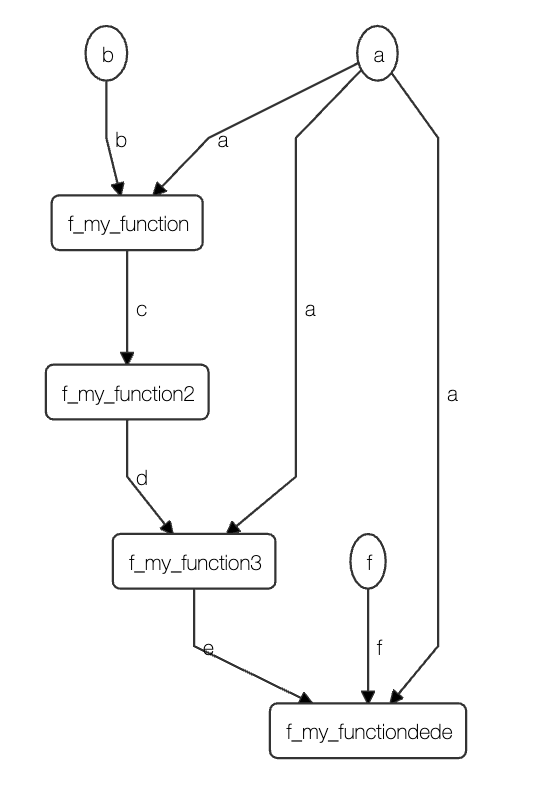

pyungo-viz
==========

Experiments for visualizing `pyungo <https://github.com/cedricleroy/pyungo>`_ graphs.

installation
------------

.. code-block:: console

    >> make build
    >> pip install -r requirements.txt

getting started
---------------

.. code-block:: console

    >> export FLASK_APP=main.py
    >> flask run

For now, the only graph loaded is ``dags/example.py``.

